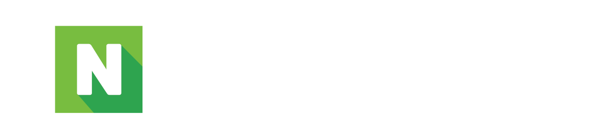
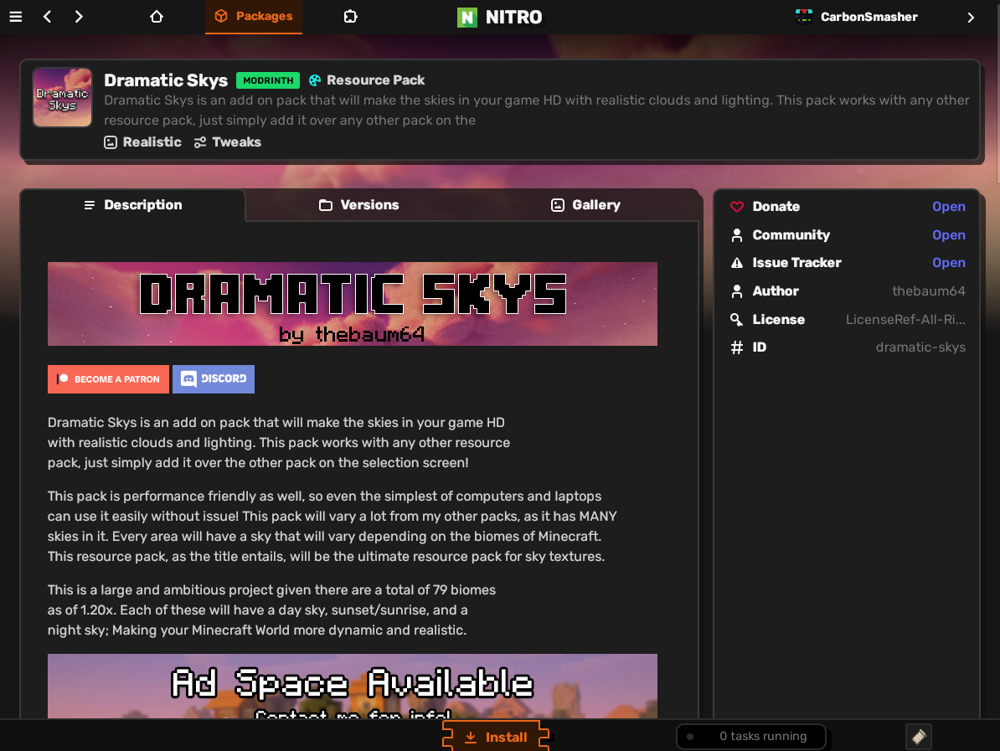
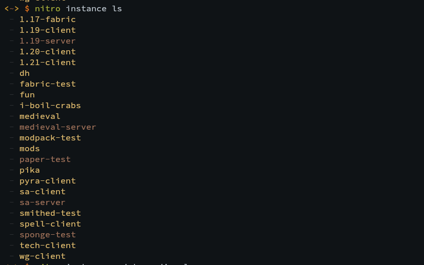
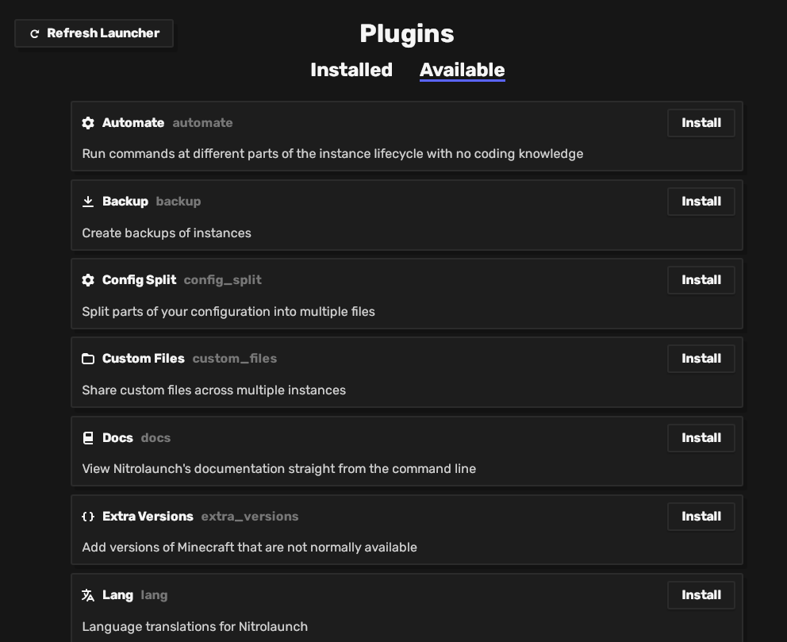
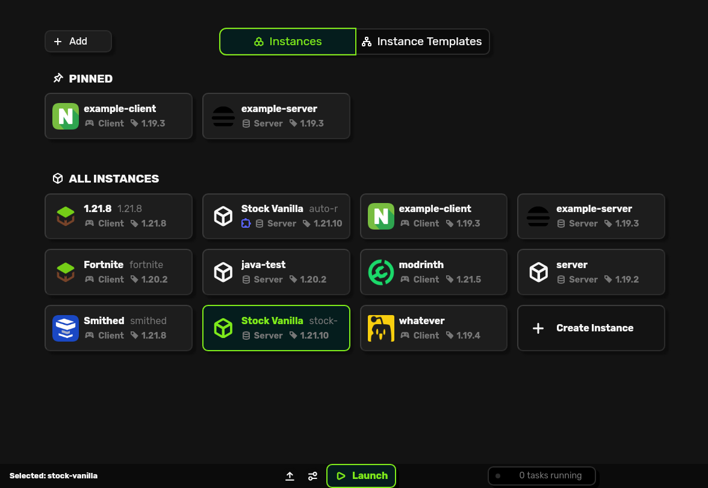
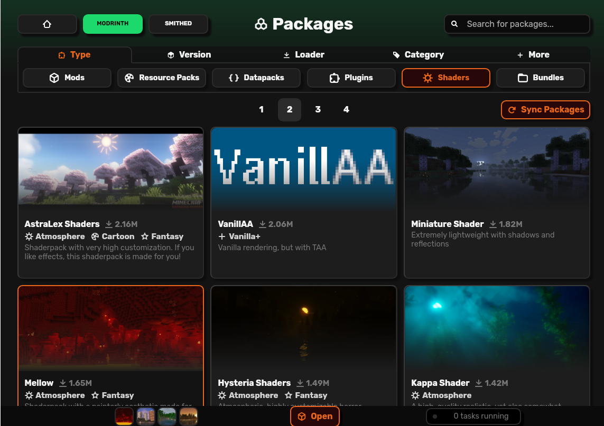
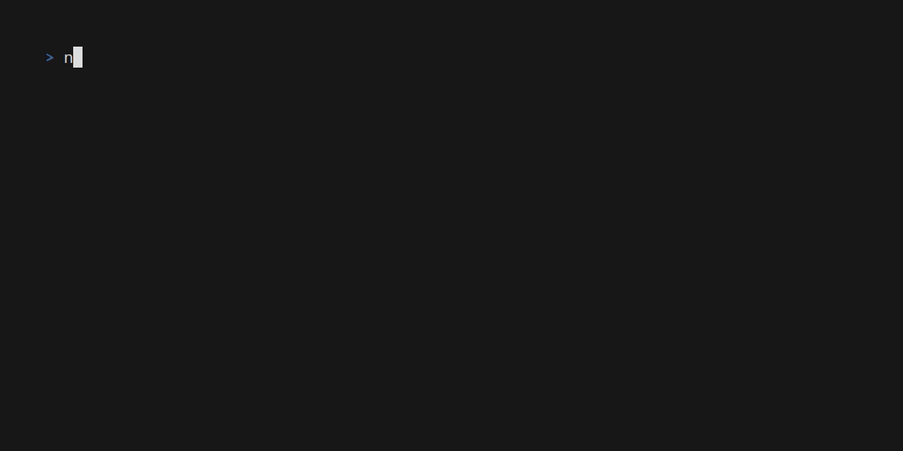

## 🚀 **A Minecraft launcher for the future**

 | [Documentation](https://nitrolaunch.github.io/nitrolaunch)

Nitrolaunch is a Minecraft launcher and ecosystem meant to reinvent the launcher as you know it, providing a plugin system and a better interface with custom content such as mods and datapacks.

In the official launcher and many alternative ones, you have to waste time moving files in and out of folders, downloading mods from sketchy websites, setting up servers, and sharing your config to play with friends. Nitrolaunch hopes to alleviate some of these pains with its smart systems for configuration sharing and package management.

In addition, Nitrolaunch is extremely modular, allowing you to build your perfect launcher by hand, or just use the amazing tools already built by the community.

# ✨ Features

## 💻 App or Command line

Nitrolaunch will work how you do, as an intuitive desktop app or CLI

|                      App                      |                    CLI                    |
| :-------------------------------------------: | :---------------------------------------: |
|  |  |

## 🔌 Plugin System

Extend the launcher with features like new modloaders and sources for mods, translations for other languages, tools to enhance your productivity, and more!

## 🫶 Play with Friends

Nitrolaunch supports both clients and servers, and you can export your configuration as a code with one click to synchronize your experience.

## 📥 Modern Packaging

Install mods, datapacks, shaders, and more from sources like Modrinth and Smithed.

## ⚡ Extremely fast, light on system resources, and available for all major platforms.

## 😺 And much more!

- ✈️ Easy to switch - Migrate from your current launcher without copying any files
- 🗜️ Enhanced datapack support, including global packs and [welding](https://weld.smithed.dev) of packs for better compatability
- 🛠️ Global and backwards-compatible options sharing
- 🗃️ Tools for server admins, like automatic file backups and creating many instances from one config

# 🚀 Getting Started

To get started with Nitrolaunch, view our [user guide](https://nitrolaunch.github.io/nitrolaunch/guide/).

## Thanks

- BubbleFish for [icons](https://github.com/bbfh-dev/eyecons), Nitrolaunch logo, and UX help
- Pika for the AUR package
- Squawkykaka for the Nix package
- Everyone helping with testing and design