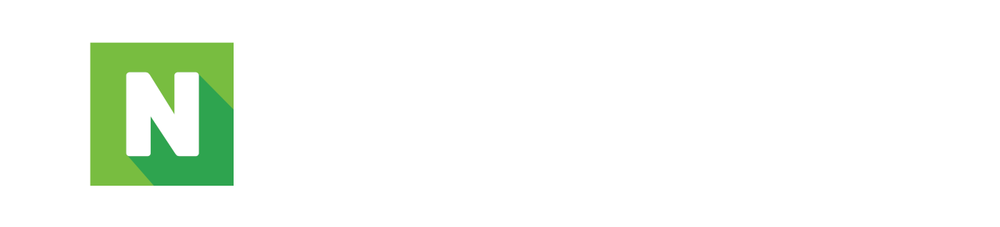
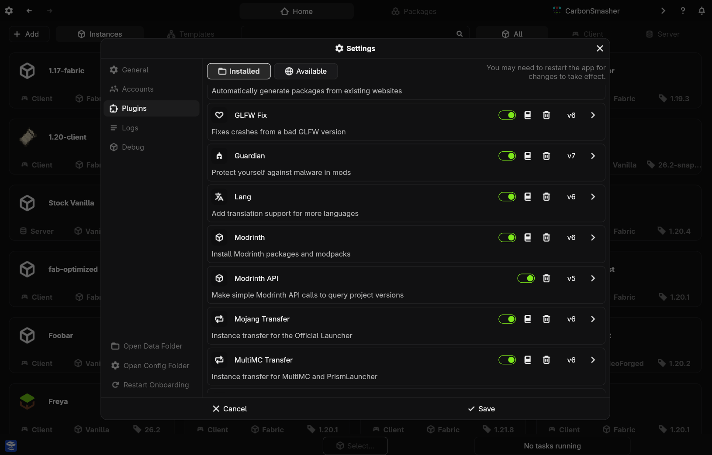

## 🚀 **The supercharged Minecraft launcher**

Nitrolaunch is a Minecraft launcher, server manager, and ecosystem meant to make playing Minecraft easier.

The design is extremely modular, letting you configure it with exactly the features you need for your setup. It's perfect for server admins, developers, or people just wanting to play the game.

- [Discord](https://discord.gg/25fhkjeTvW)
- [Website](https://Nitrolaunch.github.io)
- [Documentation](https://Nitrolaunch.github.io/nitrolaunch)

# ✨ Features

## 💻 Desktop or Command line

Nitrolaunch will work how you do, as a fully native desktop app or lightweight CLI

|                      App                      |                    CLI                    |
| :-------------------------------------------: | :---------------------------------------: |
|  |  |

## 🗃️ Modular Configuration

Share configuration between instances using instance templates.

## 🔌 Plugin System

Almost every feature of the launcher can be extended with a revolutionary plugin system. Pick and choose the features you want.

## 🫶 Play with Friends

Nitrolaunch supports both clients and servers, and you can export your templates as a code with one click to synchronize your experience.

## 📥 Modern Packaging

Install mods, datapacks, shaders, modpacks, and more from sites like Modrinth and Smithed. Make any modpack your own by adding your own packages, while keeping the original pack up to date.

## 😺 And much more!

- ✈️ Easy to switch - Migrate from your current launcher without copying any files
- 🗜️ Enhanced datapack support, including global packs and [welding](https://weld.smithed.dev) of packs for better compatability
- 🛠️ Global and backwards-compatible options sharing
- 🗃️ Tools for server admins, like automatic file backups and creating many instances from one config

# 🚀 Getting Started

To get started with Nitrolaunch, view our [user guide](https://nitrolaunch.github.io/nitrolaunch/guide/).

## Thanks

- [BubbleFish](https://github.com/bbfh-dev) for [icons](https://github.com/bbfh-dev/eyecons), Nitrolaunch logo, and UX help
- [Pika](https://github.com/PikaFan123) for the AUR package
- [Squawkykaka](https://github.com/Squawkykaka) for the Nix package
- [TheNuclearNexus](https://github.com/TheNuclearNexus) and [Kaleb Efflandt](https://github.com/macarooni-man) for partnerships and design help
- Everyone helping with testing and design
