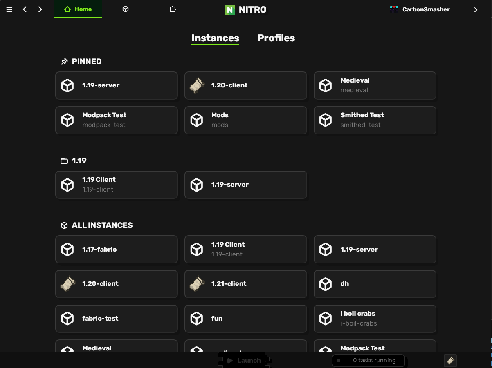

## **A Minecraft launcher for the future**

Nitrolaunch is a Minecraft launcher and ecosystem meant to reinvent the launcher as you know it, providing a plugin system and a better interface with custom content such as mods and resource packs.

In the official launcher and many alternative ones, you have to waste time moving files in and out of folders, downloading mods from sketchy websites, setting up servers, and sharing your config to play with friends. Nitrolaunch hopes to alleviate some of these pains with its smart systems for configuration sharing and package management.

In addition, Nitrolaunch is extremely modular, allowing you to build your perfect launcher by hand, or just use the amazing tools already built by the community.

# ✨ Features

## App or Command line

Nitrolaunch will work how you do, as an easy-to-use desktop app or an intuitive CLI

|                      App                      |                    CLI                    |
| :-------------------------------------------: | :---------------------------------------: |
|  |  |

## Client and Server Instances

Set up instances of both clients and servers, and share configuration between them seamlessly.

## Plugin System

Extend the launcher with features like new modloaders and sources for mods, translations for other languages, or tools to enhance your productivity

## Modern Packaging

Install packages from sources like Modrinth and Smithed. Nitrolaunch doesn't just support mods, it can install datapacks, resource packs, shaders, and more!

## In addition, Nitrolaunch is extremely fast, light on system resources, and available for all major platforms.

# 🚀 Getting Started

To get started with Nitrolaunch, view our [user guide](https://nitrolaunch.github.io/nitrolaunch/docs/guide/).

# 👷 Use Cases

Nitrolaunch has many use cases for different applications

### A command-line launcher

This is the main use case of most people, and is an important focus of the ecosystem.

### A GUI launcher

All the functionalities of the CLI in a more approachable format as a desktop application.

### A library for your launcher

You can use the Nitrolaunch library as a base for the functionalities of your launcher. Even if you don't use the packaging formats, Nitrolaunch contains functions to launch the game in a simple way, as well as customize the launch process to your liking.

### A server management tool

The Nitrolaunch CLI is the perfect assistant for server managers. The way that it groups configuration for instances makes it easy to orchestrate multiple running servers at once. Plugins can add features like launching on remote machines, config management, automatic scaling and restarts, and proxy support.

### A packaging format

Launchers can use the different Nitrolaunch crates to parse, validate, evaluate, and host Nitrolaunch packages.
