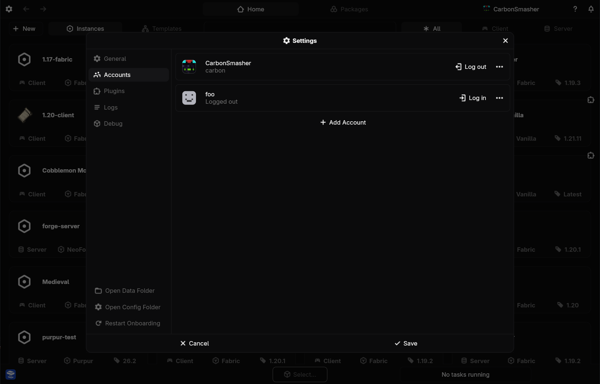

# Accounts

Nitrolaunch supports adding multiple Minecraft accounts of different types, such as standard Microsoft accounts or demo users.

!!!info Note
A valid Microsoft account that owns Minecraft is required to launch client instances.
!!!

## Adding Accounts

+++ App
Click on the settings in the top left and go to the accounts tab. Click add account and fill out the fields for the account ID and type, then click save.

+++ CLI
Run `nitro account add` and fill out the prompts for the account ID and type.
+++

## Switching Accounts

Whichever account you have selected will be used as the default for any operation, such as launching.

+++ App
Use the account switcher in the top right to select the account you want.
+++ CLI
Change the `default_account` field in your config using `nitro config edit`. You can also pass `--account <account>` to the `nitro launch` command.
+++

## Logging In

Launching an instance with a logged-out account will automatically bring up the login prompts, but you can also do it manually.

+++ App
Go to the account settings and click log in on an account, then follow the prompts that come up shortly.
+++ CLI
Run `nitro account login <account>` and follow the prompts.
+++

## Logging Out

+++ App
Go to the account settings and click `Log Out` on the account.
+++ CLI
Run `nitro account logout <account>`.
+++

## Removing Accounts

+++ App
Go to the account settings and click the three dots on the account. Then click `Delete`.
+++ CLI
Remove the account from your config with `nitro config edit`.
+++

## Launching Offline

Nitrolaunch supports offline launching as long as these two requirements are met:
1. You have logged in with a Microsoft account that owns Minecraft while you were online.
2. All of the files that are necessary for the instance to run are downloaded.

!!!info
Make sure to do these things before you go offline, as you can't complete them without an internet connection. You should probably test the launch with your WiFi disconnected before you go offline for real. 
!!!

+++ App
Go to the instance page by double clicking it on the homepage or selecting it and the clicking the more options at the bottom. Then open the launch dropdown at the top and select `Launch Offline`.
+++ CLI
Run `nitro launch --offline <instance>`.
+++