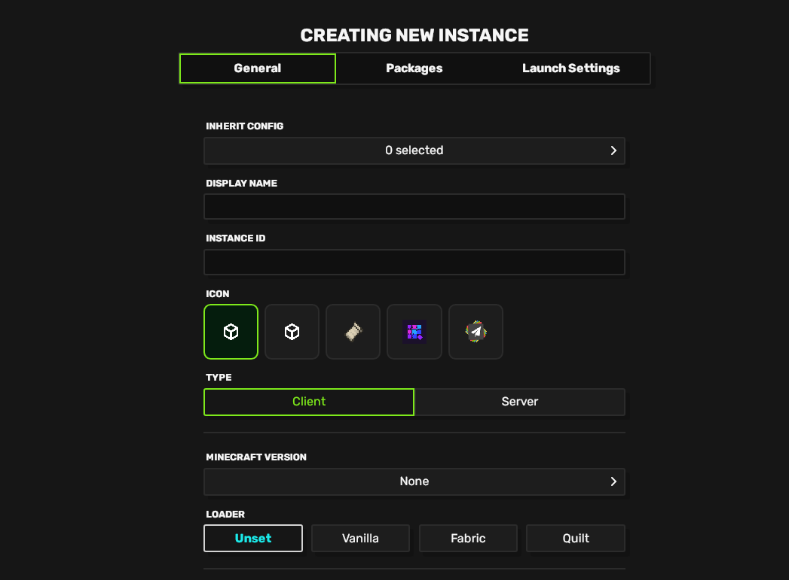

# Getting Started with Nitrolaunch

This guide will show you how to use the Nitrolaunch desktop app from the basics to more advanced features. This guide will cover most of the important things, but more in-depth info can be found throughout the documentation

## 1. Installing

Download the latest version of the launcher for your system from the [releases page](https://github.com/Nitrolaunch/nitrolaunch/releases). Make sure you choose a file labeled `gui`.

### Dev Builds

To install from one of the prebuilt development binaries, visit [nightly.link](https://nightly.link/nitrolaunch/nitrolaunch/workflows/build/dev) and download and extract the artifacts for your operating system. Note that these builds may be unstable.

## 2. Instances

Instances may be a familiar term that you have heard of before from other launchers. They are separate game installations with their own Minecraft version, modloader, files, and more. They are also the thing you actually launch when you want to play the game. The advantage of instances is that they keep worlds and configuration separate between different installations, as opposed to having conflicting files.

## 3. Starting the app

Start the app and install the default set of plugins when prompted. This will include plugins for common things like installing Fabric and installing from Modrinth.

Click the `Create Instance` button to make a new instance to launch.

## 4. Creating an Instance

Making an instance is easy.

Fill out the field for the display name, and the unique ID will fill in automatically. This ID is used to differentiate instances from each other.

Then, pick the icon, Minecraft version, and loader you want to use.

Finally, click save to finish making the new instance and return to the instances page.

## 5. Launching!

Before we launch, we must update the instance to download the necessary files and set up the instance. Select the instance from the list and click update. If this is the first time, it will probably take a couple minutes to complete.

Looks like we are ready to launch. Click the launch button to start playing! You will also be prompted to log in with your Microsoft account. Simply follow the prompts on screen.

For more info, read the other documentation or join our [Discord server](https://discord.gg/25fhkjeTvW).
When you want to start adding things like mods or resource packs to your instance, check out the [packages guide](packages.md).
