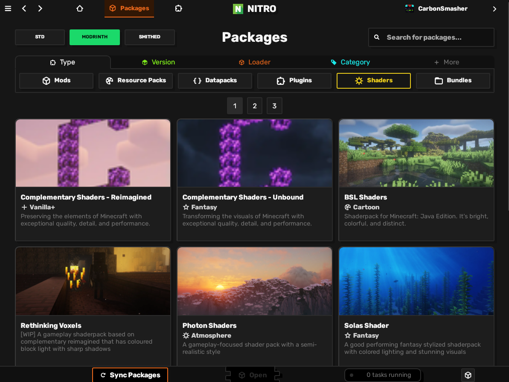
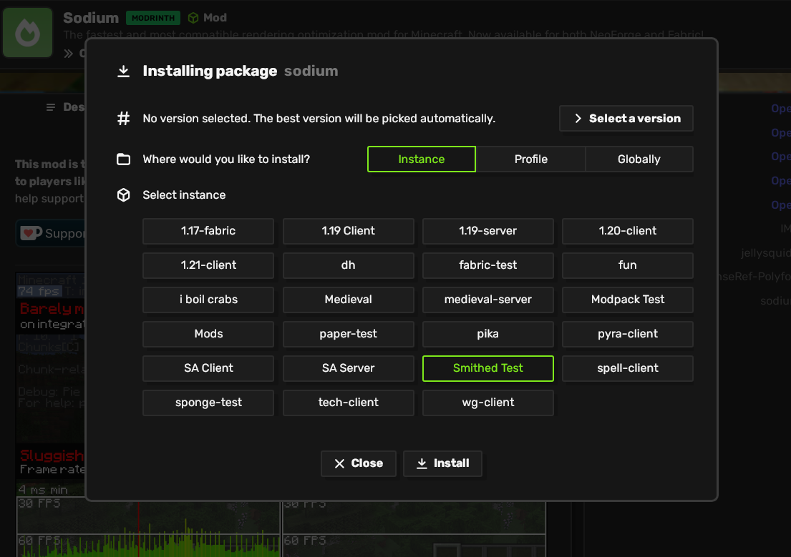
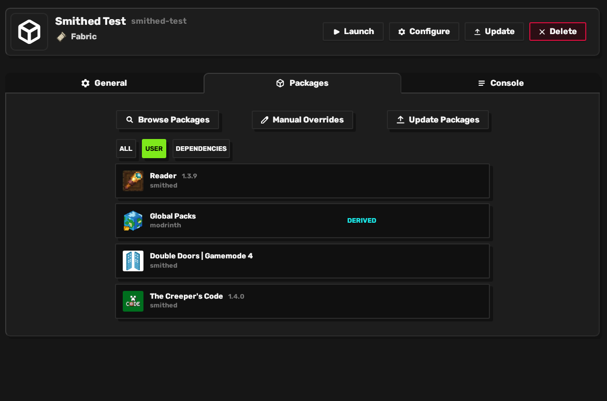

# Packages Guide

Packages in Nitrolaunch allow easy installation of mods, resource packs, and more. By using them, you don't have to worry about dependencies, downloading, what folders to use, or mod conflicts. Everything just works.

## 1. Syncing

Whenever new versions come out for the packages you use, you need to synchronize with the repositories by clicking the `Sync Packages` button at the bottom of the packages page.

## 2. Finding the packages you want

Browse packages using the packages tab at the top.

You can use the repository buttons in the top right to change what source you're getting the packages from.

There are also filters and a search bar at the top to further narrow down your results.

## 3. Adding packages to an instance

Click the install button at the bottom of the package page or on one of the versions in the versions tab. Then pick where you want to install it.

## 4. Viewing and editing packages

By navigating to an instance's page, you can edit and remove packages on that instance.

You can also click `Browse Packages` to browse for packages that are compatible with this instance.

## 4. Updating packages

You can update packages on an instance by either updating the whole instance, or navigating to the instance page and updating only the packages.
