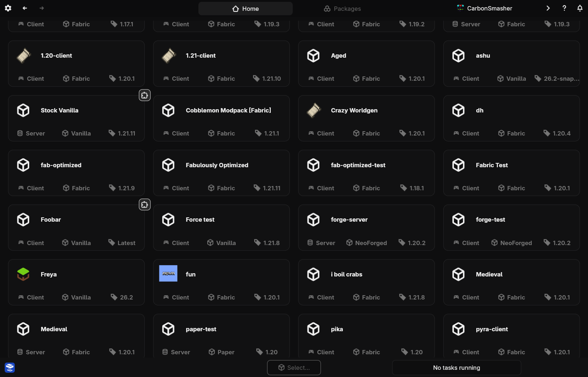
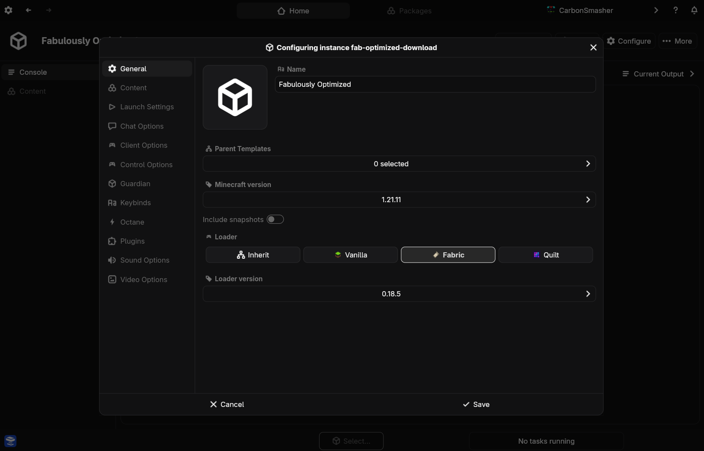

# Getting Started

Welcome to Nitrolaunch!

This guide will show you the basics of how to use Nitrolaunch. We will go over the most important things, but check out the rest of the documentation for info on how to use all of the launcher's features.

>>> Installing

+++ App
### Package manager

The package `nitrolaunch-gui` is available on the AUR package repository.

### Releases

Download the correct package for your system from [the latest release](https://github.com/Nitrolaunch/nitrolaunch/releases/latest). Make sure to download one of the assets labeled with `app`.
+++ CLI
### Package manager

The package `nitrolaunch-cli` is available on the AUR and Nix package repositories.

### Rust

To install using `cargo`, first install [Rust](https://rustup.rs/). Then run

```sh
cargo install nitro_cli
```

in your favorite terminal. This will install the CLI on your system.

### Releases

Download the correct binary for your system from [the latest release](https://github.com/Nitrolaunch/nitrolaunch/releases/latest).
Note that you will have to install it yourself.

### Dev Builds

To install from one of the prebuilt development binaries, visit [nightly.link](https://nightly.link/nitrolaunch/nitrolaunch/workflows/build/dev) and download and extract the artifacts for your operating system. Note that these builds may be unstable.
+++
>>> Starting the app

Start the app and follow through all the prompts to install default plugins, migrate from another launcher, and get your Microsoft account logged in.
>>> Instances

Instances are separate game installations with their own Minecraft version, modloader, files, and more. They are also the thing you actually launch when you want to play the game.

There are two types of instances
- Client-side: The standard Minecraft game, which can be used to play single or multiplayer
- Server-side: A dedicated server with no UI, allowing many players to join

+++ App
The Home page is where all of your instances live. You can view, add, and manage them from here. Use the filters at the top to make it easier to find the instance you want.

Click on any instance to select it.


+++ CLI
Run the command `nitro instance list` to see which instances you have installed. You can edit all of them at once with `nitro config edit`, or a specific one with `nitro instance edit`
+++
>>> Creating an Instance

+++ App
Click the `Create Instance` button to make a new instance to launch.



Fill out the field for the display name, and the unique ID will fill in automatically. This ID is used to differentiate instances from each other.

Then, pick the icon, Minecraft version, and loader you want to use.

Finally, click save to finish making the new instance and return to the instances page.
+++ CLI
Run `nitro instance add` to open an interactive prompt and set up a new instance. Make sure you enter a good ID, as it is what you'll type to launch the instance later on.
+++

>>> Launching!

+++ App
Click to select an instance from the list and then click launch at the bottom of the screen. Your game will start shortly!
+++ CLI
Run `nitro instance launch <instance_id>` to launch the instance you just created.

!!!tip Tip
You can omit the instance ID for the `launch` command and many other `instance` commands. There are also some aliases such as `inst` and `pkg` you can use to save typing.
!!!
+++

The first launch will probably take a little while since all of the game files need to be downloaded.
>>>

For more info, read the other documentation or join our [Discord server](https://discord.gg/25fhkjeTvW).
When you want to start adding things like mods or resource packs to your instance, check out the [packages guide](packages.md).
