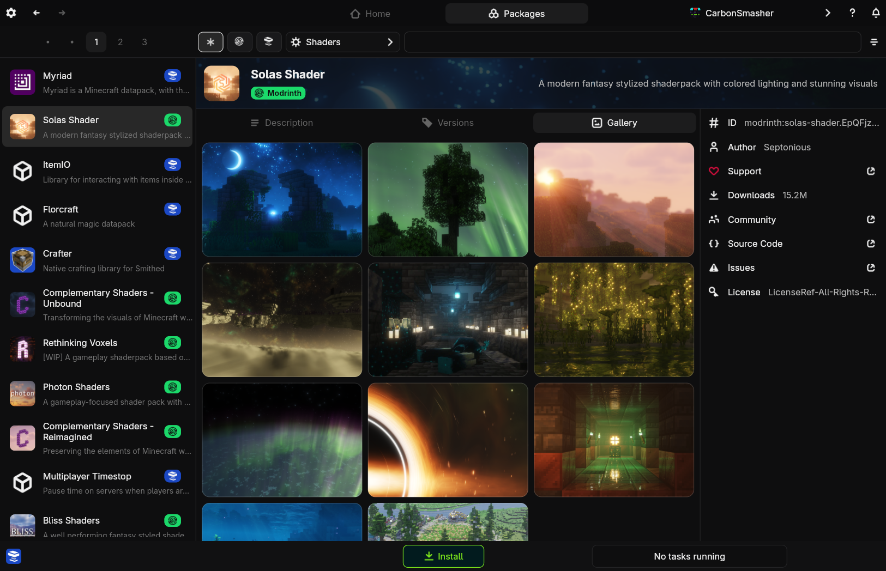
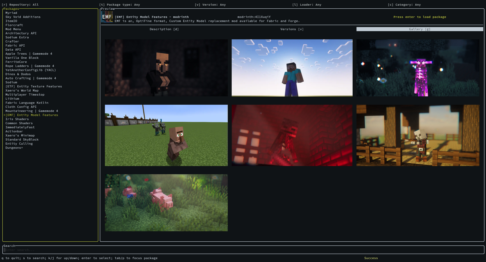
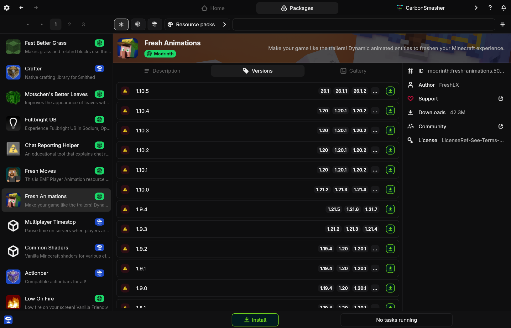
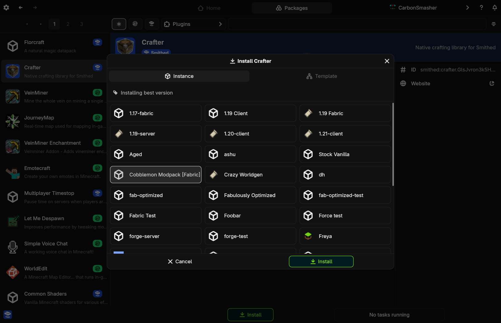
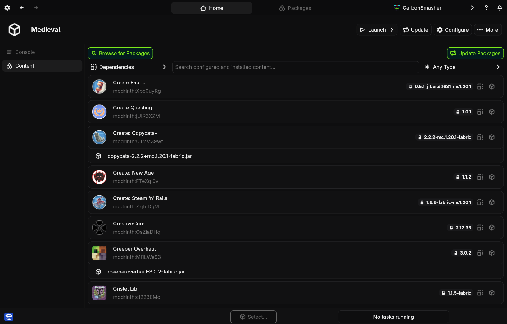

# Packages

Packages are a blanket term for content you can add to an instance, such as mods, resource packs, and datapacks.

## Repositories

Repositories are simply sources for packages. Some examples:
- Modrinth
- Smithed
- CurseForge

By default, all of these repositories should be installed with their respective plugins. If not, I would recommend installing at least one of them now.

## Installing a package

>>> Browse for packages

First, you have to find some packages to install.

+++ App
Navigate to the packages tab at the top to start browsing. 

+++ CLI
Run `nitro package browse` to enter the package browser. Keybinds are written in brackets next to items, and at the bottom. Press `q` to exit.

+++

Use the filters at the top to select which repository to use, what types of packages to look for, and filter by other things like the loader or Minecraft version. By default, Nitrolaunch will search all repositories at once and combine the results.
>>> Add the package

+++ App
Start by either clicking the install button, or one of the install buttons on a version in the versions tab.

This will bring up a menu where you can pick which instance or template to install on.

+++ CLI
Find the package you want and press `i` to bring up the install menu, or switch to the versions tab and press `i` on the version you want to install. Select the instance or template to install on.
+++
>>> Installing

The next time the instance launches, the package will be automatically installed.

!!!warning The auto-install will not touch any other packages, and only add necessary dependencies. If you want to ensure that all of the versions match up with your existing packages, you should update the instance.
>>>

## Updating Packages
Packages will be updated whenever you do a standard instance update. However, you can also update only the packages if you want a faster update or want to leave other instance attributes alone.

+++ App
Navigate to the instance's content page, and click `Update Packages` to update.

+++ CLI
Run `nitro instance update --packages`.
+++

!!!warning Do not use in-game updaters
In-game mod updaters like ModMenu will not work properly with Nitrolaunch packages as updating will remove Nitrolaunch's file and replace it with an untracked one. Please do not use these updaters on Nitrolaunch packages.
!!!

## Removing Packages
+++ App
Navigate to the instance's content page, and click the 3 dots to bring up the remove option.
+++ CLI
Use `nitro instance edit` and remove the package from the instance's configuration.
+++

## Package Versions
When you install a specific version of a package, Nitrolaunch will **lock** it to that version in your configuration. If you look at the configuration, it will be specified with `@version` after the package name.

!!!info This means that even if you update, that package will not change versions.
!!!

To unlock a package, follow these steps and then update your instance.
+++ App
Go to the package's page and install it with the global install button rather than a specific version one.
+++ CLI
Use `nitro instance edit` and remove the `@version` from the end.
+++